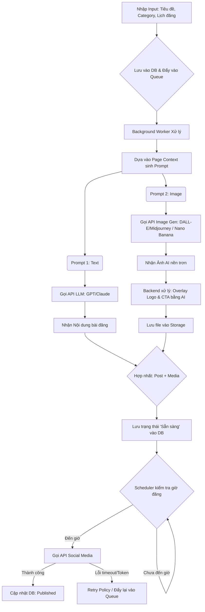
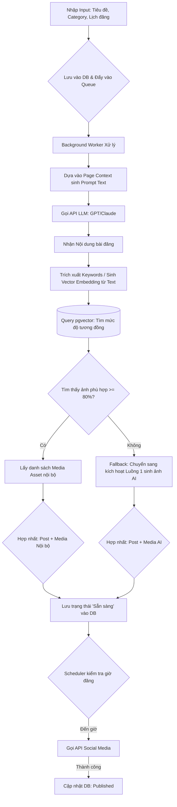

# Luồng 1: Full AI Generation (Sinh Text & Ảnh tự động)

Luồng này tập trung vào việc tách biệt tác vụ sinh **Text** và sinh **Ảnh** ngay trên mô hình (request gửi đi gồm cả logo và CTA cho mỗi page) để chạy song song (**Parallel Processing**) nhằm tối ưu thời gian.



## Các bước implement (chia nhỏ)

Đánh `[x]` khi bước đã đúng trong code + đã test. Mỗi bước = 1 session với AI.

### 1.1 Tạo post + đẩy queue
- **Input:** tiêu đề, categoryId, socialChannelId, lịch đăng, generationFlow = FullAI
- **Hành vi:** lưu Post vào DB, status ban đầu phù hợp (vd Draft/Queued), tạo job đưa vào queue
- **Output:** `GET post/{id}` có data; có record job trong queue
- **Edge case:** thiếu channel / category → trả lỗi validate, không tạo job
- **Checklist:** [ ]

### 1.2 Worker sinh text
- **Input:** job text generation cho post
- **Hành vi:** lấy Page Context → build prompt text → gọi LLM (hoặc mock nếu không có key) → lưu `Content` vào Post
- **Output:** post có Content; generation-status step text = Done
- **Edge case:** LLM fail → đánh dấu step Failed, không chặn toàn hệ thống; có thể retry
- **Checklist:** [ ]

### 1.3 Worker sinh ảnh + overlay
- **Input:** job image generation (chạy song song với 1.2 nếu được)
- **Hành vi:** gọi image gen → nhận ảnh nền → overlay logo & CTA theo page → lưu file Storage → gắn Media với Post
- **Output:** post có media cover; file tồn tại trên storage; generation-status image/render = Done
- **Edge case:** image gen fail → step Failed + retry; overlay fail không mất ảnh gốc nếu đã lưu
- **Checklist:** [ ]

### 1.4 Hợp nhất → Ready
- **Điều kiện:** cả text Done **và** image/render Done
- **Hành vi:** cập nhật post status = Ready (Sẵn sàng)
- **Output:** status Ready; đủ Content + Media
- **Edge case:** một nhánh fail → không chuyển Ready; UI hiện step nào fail
- **Checklist:** [ ]

### 1.5 Scheduler đăng bài
- **Điều kiện:** status = Ready **và** `scheduledAt <= now`
- **Hành vi:** gọi API social (Facebook); thành công → Published + lưu postId ngoài; fail → PublishFailed hoặc đẩy lại queue theo retry
- **Output:** Published hoặc trạng thái lỗi rõ ràng
- **Edge case:** chưa đến giờ → bỏ qua; token hết hạn → lỗi rõ, không silent fail
- **Checklist:** [ ]

### 1.6 Retry publish
- **Điều kiện:** publish lỗi (timeout / rate limit / token tạm)
- **Hành vi:** retry tối đa 3 lần, cách nhau ~5 phút; hết lần → PublishFailed
- **Output:** hoặc Published, hoặc PublishFailed + message lỗi
- **Checklist:** [ ]

### 1.7 UI theo dõi (FE)
- **Màn:** tạo post, list post, detail + generation-status
- **Hành vi:** hiện từng step (text/image/render/publish), loading/error/empty
- **Nút liên quan (nếu có):** xem status, đăng lại khi PublishFailed (spec riêng theo mẫu nút)
- **Checklist:** [ ]

---

# Luồng 2: AI Content + Tự động tìm kiếm RAG

Luồng này tận dụng kho **Media** sẵn có. Sau khi **LLM** viết xong phần **Text**, hệ thống nhúng nội dung thành **Vector** và query kho media để tìm ảnh tương đồng nhất.



## Các bước implement (chia nhỏ)

### 2.1 Tạo post (flow = RAG) + queue
- Giống 1.1 nhưng `generationFlow = RAG` (hoặc tên enum hiện có trong project)
- **Checklist:** [ ]

### 2.2 Worker sinh text
- Giống 1.2
- **Checklist:** [ ]

### 2.3 Embedding + tìm media nội bộ
- **Hành vi:** embed text → query kho media → lấy ảnh similarity >= 80%
- **Output:** gắn media nội bộ vào post **hoặc** không tìm thấy
- **Edge case:** kho rỗng / không đạt ngưỡng → không gắn ảnh, chuyển 2.4
- **Checklist:** [ ]

### 2.4 Fallback sang sinh ảnh AI (Luồng 1)
- **Điều kiện:** 2.3 không đủ ảnh
- **Hành vi:** kích hoạt nhánh image gen + overlay như 1.3 (tái dùng code, không viết lại)
- **Checklist:** [ ]

### 2.5 Hợp nhất → Ready → Scheduler → Retry
- Tái dùng 1.4, 1.5, 1.6
- **Checklist:** [ ]

### 2.6 UI chọn flow + hiện nguồn ảnh (nội bộ / AI)
- **Checklist:** [ ]

---

# Điểm lưu ý trong cấu trúc kỹ thuật

## 1. Fallback Mechanism (Luồng 2)

Nút **"Tìm thấy ảnh phù hợp >= 80%"** bắt buộc. Không khớp → tự gọi mô đun sinh ảnh Luồng 1, bài không được thiếu hình.

## 2. Transaction Integrity

Lưu Posts và trạng thái Media phải rõ từng step. Một nhánh (Text hoặc Ảnh) lỗi giữa chừng không để data “nửa nạc nửa mỡ” (vd Ready nhưng thiếu Content).

## 3. Queue / Retry

Gọi API Social luôn kèm Retry (vd 3 lần, cách 5 phút) vì Facebook thường rate limit / gián đoạn tạm.

---

# Cách dùng file này với AI (mẫu prompt)

Copy chỉnh số bước rồi gửi:

```text
Đọc @_ai_agent/business/dang_bai_tu_dong.md — chỉ làm bước 1.5 Scheduler đăng bài.

Đối chiếu code hiện tại: bước nào đã có, chỗ nào lệch so với mô tả.
CHƯA CODE. Liệt kê:
1. File sẽ sửa
2. Status trước/sau
3. Edge case sẽ handle

Chờ mình duyệt rồi mới implement.
```

Khi chỉ thêm nút (không đổi cả luồng), dùng spec nút ngắn trong chat — không cần viết lại cả file này; chỉ cập nhật bước liên quan nếu đổi hành vi hệ thống.
