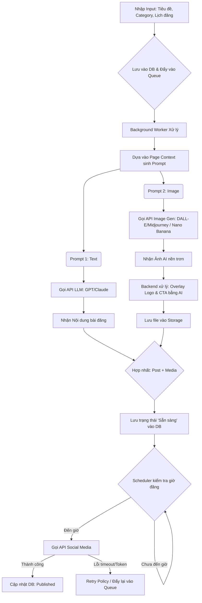
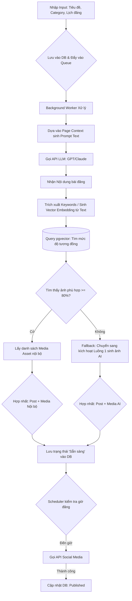

# Luồng 1: Full AI Generation (Sinh Text & Ảnh tự động)

Luồng này tập trung vào việc tách biệt tác vụ sinh **Text** và sinh **Ảnh** ngay trên mô hình ( request gửi đi gồm cả logo và CTA cho mỗi page) để chạy song song (**Parallel Processing**) nhằm tối ưu thời gian.

---

# Luồng 2: AI Content + Tự động tìm kiếm RAG (Retrieval-Augmented Generation)

Luồng này tận dụng kho **Media** sẵn có. Sau khi **LLM** viết xong phần **Text**, hệ thống sẽ nhúng (**embedding**) nội dung đó thành **Vector** và query thẳng vào cơ sở dữ liệu (sử dụng các extension như **pgvector**) để tìm bức ảnh có khoảng cách ngữ nghĩa gần nhất.

---

# Điểm lưu ý trong cấu trúc kỹ thuật

## 1. Fallback Mechanism (Cơ chế dự phòng) trong Luồng 2

Nút điều kiện **"Tìm thấy ảnh phù hợp >= 80%"** là rất quan trọng.

Nếu kho nội bộ không có ảnh nào khớp, hệ thống phải tự động gọi lại mô đun sinh ảnh bằng AI của **Luồng 1** để bài đăng không bị thiếu hình.

---

## 2. Transaction Integrity

Quá trình lưu **Posts** và trạng thái **Media** cần tuân thủ cấu trúc chuẩn hóa (**3NF**) để đảm bảo không bị rác dữ liệu nếu một nhánh (**Text** hoặc **Ảnh**) gọi API bị lỗi giữa chừng.

---

## 3. Queue / Retry

Tác vụ **Gọi API Social Media** phải luôn đi kèm cơ chế **Retry** (ví dụ thử lại **3 lần cách nhau 5 phút**) vì API của **Facebook/LinkedIn** thường xuyên có tình trạng **rate limit** hoặc gián đoạn mạng tạm thời.