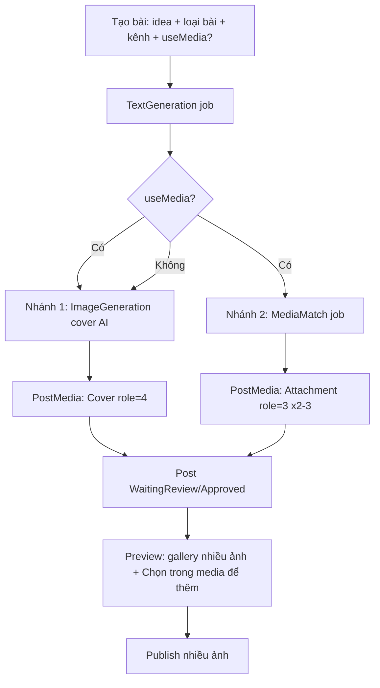

# Nhánh 2 tự động (RAG media) + đăng nhiều ảnh — Nghiên cứu & Plan hoàn thiện

> Tính năng "đắt giá nhất" của project: sau khi AI viết nội dung, hệ thống **tự động** tìm và
> gắn 2–3 ảnh phù hợp nhất từ kho Media (nhánh 2), song song với nhánh sinh ảnh AI (nhánh 1);
> người dùng chọn **nhiều ảnh** để đăng và đăng **nhiều ảnh** lên Facebook.
>
> Đọc kèm: `dang_bai_tu_dong.md` (Luồng 1 & 2), `sinh_anh_tu_caption.md` (nhánh 1),
> `media_folder.md` (kho media), `_ai_agent/database` (schema), `coding/backend_guide.md`.
>
> Trạng thái: **CHƯA CODE — mới nghiên cứu + plan, chờ duyệt.** Ngày lập: 2026-07-22.

---

## 0. TL;DR (đọc trước khi đi sâu)

Đối chiếu code thật, bức tranh **khác** so với cảm nhận "post chỉ chọn/đăng được 1 ảnh":

| Thành phần | Tình trạng thật trong code | Kết luận |
|---|---|---|
| Data model nhiều ảnh (`PostMedia` role + sortOrder) | ✅ Đã có, 3NF | Không cần đổi schema |
| Attach/gỡ/đổi-cover nhiều ảnh (UI) | ✅ `PostMediaPanel` + `usePostMedia` | Đã chạy |
| Đăng **nhiều ảnh** lên Facebook | ✅ `FacebookPagePublishService.PublishMultiPhotoFeedAsync` | Đã chạy end-to-end |
| Nhánh 1 — sinh ảnh AI (cover) | ✅ `ProcessImageGenerationAsync` | Đã chạy |
| Nhánh 2 — **tự động** tìm media theo nội dung | ❌ **Chưa có trong pipeline** | **Việc chính phải làm** |
| Chọn media bằng AI (thủ công) | ⚠️ Có, nhưng chỉ **1 tầng lexical** (`RecommendAsync`), gọi tay qua `AiMediaPickerModal` | Cần nâng cấp + tự động hoá |
| Chọn "loại bài viết" + "có dùng media?" khi tạo bài | ❌ Form hard-code `generationFlow: 1` | Cần thêm UI + luồng |
| Upload **cả folder** nhiều ảnh | ❌ Chỉ 1 file/lần | Cần thêm |
| Media gắn "áp dụng cho loại bài nào" (đa trị) | ❌ Chỉ có `CategoryId` đơn trị (form upload chưa cho chọn) | Thêm `CategoryIds` (Categories, đa trị) |
| Taxonomy: "loại bài" vs "danh mục" trùng nhau | ⚠️ `Categories` (bỏ không) **và** `PromptTemplate` (Name="Bán hàng") cùng nghĩa "danh mục" | Tách vai: `Categories`=loại bài, `PromptTemplate`=template |
| `MediaEmbedding` (vector RAG) | ⚠️ **Dead code** — bảng + repo có, nhưng `RecommendAsync` dùng lexical, không query vector | Giữ lexical, không dùng vector (D5) |

> **Điểm mấu chốt:** "đăng nhiều ảnh" về mặt hạ tầng **đã xong**. Giá trị thực sự cần build là
> **tự động hoá nhánh 2** (AI lọc 2–3 ảnh theo nội dung + loại bài) và **ghép nó vào pipeline
> tạo bài**, rồi đơn giản hoá UI (bỏ nút "chọn media phù hợp" thủ công → còn "chọn trong media").

---

## 1. Phạm vi (theo yêu cầu sếp)

### 1.1 Media
1. Upload media — **có thể cả folder nhiều ảnh** → nhập **tên** + **áp dụng cho loại bài nào**.
2. Upload xong → AI đọc **từng ảnh** → gắn **key nhãn** (keywords) + **mô tả** (description).
   - Ví dụ: ảnh trao chứng chỉ → tiêu đề "Trao chứng chỉ HSK2 ngày 22/07/2026", loại bài (bán hàng / tuyển sinh…).

### 1.2 Post
1. Tạo bài: thêm **chọn loại bài viết** + **chọn có dùng media hay không**.
2. CallAI tạo nội dung → xong thì **2 nhánh chạy tiếp**:
   - **Nhánh 1** — CallAI sinh ảnh (banner AI).
   - **Nhánh 2** — dùng **loại bài** để tìm ảnh trong kho (`listMedia1`):
     - lấy (nội dung ảnh + key) → request → **CallAI chọn các key phù hợp** → lọc `listMedia1`;
     - lấy nội dung bài → **dò với mô tả AI của từng ảnh** trong `listMedia2` → **CallAI chọn 2–3 ảnh** phù hợp nhất.
   - ⇒ Post hoàn chỉnh: cover AI (nhánh 1) + 2–3 ảnh kho (nhánh 2).
3. **Đổi hành vi hiện tại:**
   - Bỏ nút **"✨ Chọn media phù hợp"** (AI recommend thủ công) trong post — vì việc lọc AI **đã nằm ở nhánh 2** khi tạo bài.
   - Thay bằng **"Chọn trong media"** (duyệt kho thuần) để user **thêm ảnh** nếu muốn (nhánh 2 chỉ lấy 2–3 ảnh).
   - Chọn **nhiều ảnh** để đăng và **đăng nhiều ảnh** (hạ tầng đã có — chỉ cần đảm bảo luồng tạo bài tự gắn nhiều ảnh + UI rõ ràng).

---

## 2. Hiện trạng chi tiết (đối chiếu code)

### 2.1 Pipeline sinh nội dung — `GenerateForPostAsync`
`backend/Modules/GenerationJob/GenerationJobPipelineService.cs:57`

```
GenerateForPostAsync(postId):
  1. QueueTextGenerationAsync → ProcessAsync   (sinh text, lưu Content + ExtraJson.textGeneration)
  2. NẾU HasAttachedMediaAsync(post) == true  → return (bỏ sinh ảnh)   [dòng 62]
  3. NGƯỢC LẠI → QueueImageGenerationAsync → ProcessAsync (sinh 1 ảnh AI, ReplaceCover)
```

- Gọi từ: `PostController.create-and-generate` (`PostController.cs:177`, 1 kênh, đồng bộ) **và**
  `PostGenerationWorker` (`Shared/Generation/PostGenerationWorker.cs:85`, bulk/nhiều kênh, chạy nền).
  → **Thêm nhánh 2 vào đúng `GenerateForPostAsync` là phủ cả 2 đường.**
- `GenerationFlow` (FullAI=1 / RAG=2) hiện **không đổi hành vi**: `ResolveFlowType` (dòng 1096) chỉ set
  `job.FlowType` làm metadata. RAG **không** kích hoạt tìm media.
- `JobType.MediaMatch = 4` có trong enum nhưng `ProcessAsync` (dòng 207) **ném lỗi** cho type này → chưa hiện thực.
- Ảnh AI được `ReplaceCoverAsync` (dòng 879) → luôn **thay** cover, chỉ 1 cover.

### 2.2 Media matching (nhánh 2) — hiện chỉ THỦ CÔNG & 1 tầng
`backend/Modules/MediaAsset/MediaIntelligenceService.cs`

- `RecommendAsync` (dòng 194): `ExtractQueryKeywordsAsync` (1 lần call LLM, fallback lexical) →
  lấy ≤500 candidate → **chấm điểm lexical** (`keywordScore*0.7 + tokenOverlap*0.22 + analyzedBoost`) → top N.
- **Chỉ 1 lần gọi AI** (trích keyword của query). **Không** có bước "CallAI chọn key" rồi "CallAI dò description
  chọn 2–3 ảnh" như spec. Đây là bản rút gọn so với yêu cầu 2 tầng của sếp.
- Endpoint: `POST /api/mediaasset/recommend` (`MediaAssetController.cs:131`).
- Gắn nhãn ảnh: `AnalyzeAndSaveAsync` (dòng 71) — GPT vision → 5–7 keywords + altText + description,
  lưu `Tags` (JSON `{keywords, aiAnalysis}`) + `Description`. Chạy tự động khi upload (`Upload`, dòng 44)
  và khi sinh ảnh AI (`ProcessImageGenerationAsync`, dòng 861). ✅ **Phần "AI đọc ảnh → gắn key + mô tả" đã đủ.**

### 2.3 MediaEmbedding — dead code
- Bảng `MediaEmbeddings` + `MediaEmbeddingRepository` tồn tại, chỉ được **đăng ký DI** (`Program.cs:131`),
  **không nơi nào** sinh/lấy vector để rank. `RecommendAsync` thuần lexical.
- ⇒ RAG "vector similarity ≥ 80%" trong `dang_bai_tu_dong.md` **chưa** phản ánh code thật.

### 2.4 Multi-image — đã hoàn chỉnh end-to-end
- **Model:** `PostMediaModel` (PostId, MediaId, `MediaRole` Primary/Thumbnail/Attachment/Cover, SortOrder).
- **Attach nhiều ảnh:** `usePostMedia.useAttachPostMedia` — ảnh đầu = cover (role 4), còn lại attachment (role 3).
- **Quản lý UI:** `PostMediaPanel.jsx` — thêm/gỡ/đổi cover, poll khi đang generate.
- **Publish nhiều ảnh:** `PublishPipelineService.ResolvePublishMediaListAsync` (`:471`) build danh sách cover-first
  → `SocialPublishRequest.MediaItems` → `FacebookPagePublishService.PublishAsync` (`:33`):
  - `MediaItems.Count > 1` → `PublishMultiPhotoFeedAsync` (upload ảnh unpublished lấy `media_fbid` → `/feed`
    với `attached_media[i]`). Ảnh cover lỗi → fail; ảnh phụ lỗi → bỏ qua, vẫn đăng phần còn lại.
  - `== 1` → 1 ảnh (multipart/url). `== 0` → text-only.
- ⇒ **Không cần sửa tầng publish.** Chỉ cần luồng tạo bài **gắn sẵn nhiều ảnh**.

### 2.5 Tạo bài (FE) & upload media (FE)
- `PostCreateForm.jsx:66` **hard-code `generationFlow: 1`**; không có chọn "loại bài" (ngoài danh mục/template
  khi thiếu PageContext) và không có toggle "dùng media".
- `MediaUploadForm.jsx`: `input type=file` **không `multiple`**, gửi 1 `file`; không có field "loại bài";
  chỉ chọn folder + altText. Upload xong BE tự AI-tag.
- `AiMediaPickerModal.jsx`: **đã multi-select** (Map, "Dùng N ảnh"), 2 tab (AI gợi ý / Tất cả). Nút mở nó là
  "✨ Chọn media phù hợp" trong `PostMediaPanel.jsx:132` — **đây là nút cần bỏ / đổi.**

### 2.6 Bảng dữ liệu liên quan (đã có, không cần tạo mới)
`PostMedia`, `MediaAssets` (`Description`, `Tags`, `CategoryId`, `FolderId`), `GenerationJobs`
(`JobType.MediaMatch`, `InputPayload/OutputPayload`), `Categories` (dùng chung post & media).

---

## 3. Gap analysis (Yêu cầu ↔ Code)

| # | Yêu cầu | Code hiện tại | Gap |
|---|---|---|---|
| G1 | Nhánh 2 **tự động** trong pipeline | Không có | **Lớn** — build `MediaMatch` job + ghép vào `GenerateForPostAsync` |
| G2 | Nhánh 2 chọn key + chọn 2–3 ảnh theo description | `RecommendAsync` 1 tầng lexical, thủ công | **Vừa** — gộp về **1 call AI** tối ưu token (mục 4.2) |
| G3 | Tạo bài: chọn **loại bài** + **có dùng media?** | Hard-code FullAI | **Vừa** — FE form + DTO + luồng |
| G4 | Bỏ nút "chọn media phù hợp", còn "chọn trong media" thuần | Nút mở `AiMediaPickerModal` | **Nhỏ** — sửa `PostMediaPanel` + picker mode |
| G5 | Chọn nhiều ảnh + đăng nhiều ảnh | Hạ tầng đã có | **Rất nhỏ** — đảm bảo auto-attach nhiều + UX |
| G6 | Upload **cả folder** nhiều ảnh | 1 file/lần | **Vừa** — FE multiple + BE bulk-upload |
| G7 | Media: **tên** + "áp dụng cho loại bài nào" (đa trị) | Chỉ `CategoryId` đơn trị (form không cho chọn) | **Nhỏ** — thêm `CategoryIds` + chọn khi upload |
| G8 | AI đọc ảnh → key + mô tả | `AnalyzeAndSaveAsync` | ✅ Đủ (giữ nguyên) |
| G9 | `MediaEmbedding` vector | Dead code | Giữ lexical cho MVP, không dùng vector (D5) |

---

## 4. Kiến trúc đề xuất

### 4.1 Luồng tạo bài mới (mục tiêu)



**Khác biệt so với `dang_bai_tu_dong.md` cũ:** doc cũ mô tả nhánh 2 là *fallback* của nhánh 1
(chỉ chạy khi không match ≥80%). Theo yêu cầu mới, **cả hai nhánh chạy** khi `useMedia = true`:
cover = ảnh AI, attachments = 2–3 ảnh kho. (Cấu hình được: xem Quyết định D3.)

### 4.2 Nhánh 2 — `MediaMatch` (tối ưu token: lexical làm nặng + **1 call AI**)

> Nguyên tắc token: **lexical (0 token) thu hẹp kho; AI chỉ quyết định cuối cùng 1 lần.**
> Gộp "chọn key" + "dò mô tả" vào **một call** vì cùng một suy luận ở quy mô 15–20 ảnh.

```
MediaMatch(postId):
  content  = truncate(post.Content ?? Title, ~400 ký tự)
  postType = post.CategoryId                                   # loại bài (Categories)
  # (0 token) Tiền lọc: kho → candidate theo loại bài + lexical
  listMedia1 = MediaAssets(image, analyzed,
                 CategoryIds chứa postType HOẶC CategoryIds rỗng)   # dùng-chung
               rank lexical (keyword/token overlap, tái dùng RecommendAsync) → top 15–20
  # (1 call AI) gửi content rút gọn + candidate NÉN → trả thẳng 2–3 index
  payload  = [{ i:1, kw:[≤5 keyword], d:"description cắt ~80 ký tự" }, ...]
  picked   = CallAI(system + content + payload) → {"picked":[i,...]}   # temperature 0, max_tokens nhỏ
  map index → MediaAssetId
  attach picked → PostMedia role=Attachment (SortOrder nối tiếp); chưa có cover thì ảnh đầu = Cover
```

**Tối ưu token áp dụng:**
- **Bỏ call "trích keyword query"**: tokenize content + tái dùng `hashtags`/`bannerHeadline` có sẵn trong
  `Post.ExtraJson.textGeneration` (0 token) để chạy lexical.
- **Không gửi cả kho** — chỉ 15–20 ảnh sau tiền lọc.
- **Nén candidate**: `index` số thay GUID (~34 ký tự/ảnh), keyword top-5, description cắt ~80 ký tự.
- **Cắt content ~400 ký tự**; `temperature=0`; `max_tokens` nhỏ (output chỉ mảng số).
- (Bulk) cân nhắc **prompt caching** system prompt cố định.
- Ước lượng: ~**1 call, ~1–2k token input** thay vì 3 call / hàng chục nghìn token nếu gửi cả kho.

**An toàn:** AI lỗi/timeout → fallback lấy top lexical (`listMedia1`) → **không chặn bài**.
Idempotent qua `IdempotencyKey`; ghi `InputPayload/OutputPayload` để audit.
Kho rỗng / không ảnh analyzed / không khớp loại bài → trả rỗng (bài vẫn có cover AI từ nhánh 1).

### 4.3 Song song hai nhánh
- MVP: chạy **tuần tự** trong `GenerateForPostAsync` (text → nhánh 1 → nhánh 2) cho đơn giản/đúng thứ tự DB.
- Tối ưu (sau): chạy `Task.WhenAll(nhánh1, nhánh2)` với **DbContext riêng mỗi nhánh** (tránh dùng chung
  `DbContext` không thread-safe). Xem Rủi ro R2.

### 4.4 Data model
- **Không cần bảng mới.** Chỉ cân nhắc: thêm `MediaAsset.PostType`/tái dùng `CategoryId` cho "loại bài" (D2).
- Ghi nguồn ảnh nhánh 2 (điểm khớp, AI hay lexical) vào `PostMedia.ExtraJson` để UI hiển thị "vì sao gợi ý".

---

## 5. Plan siêu chi tiết (chia phase, mỗi bước build/test được)

> Quy ước: `[ ]` chưa làm. Mỗi bước ghi **file sửa/tạo**, **hành vi**, **edge case**, **cách test**.
> Thứ tự tối ưu để mỗi phase độc lập verify.

### Phase 0 — Chốt quyết định thiết kế (mục 7) trước khi code. `[ ]`

### Phase 1 — Backend: `MediaMatchService` (nhánh 2, **1 call AI** tối ưu token) `[ ]`
- **Tạo/sửa:**
  - `Modules/MediaAsset/MediaIntelligenceService.cs`: thêm `PickBestMediaAsync(content, candidates[])`
    — **1 call** chat-completions nhận content rút gọn + candidate nén, trả mảng index; có timeout + fallback.
    Tái dùng `CallChatCompletionsAsync`, `ResolveConfig`, `ParseKeywords`, lexical scoring của `RecommendAsync`.
  - `Modules/GenerationJob/MediaMatchService.cs` **(mới)** hoặc method trong pipeline: orchestration
    tiền lọc lexical (listMedia1) → 1 call AI → map index → trả `List<MediaAssetModel>` (2–3 ảnh).
- **Hành vi:** thuần đọc + gọi AI, chưa attach (tách để test riêng). Xem pseudocode mục 4.2.
- **Edge case:** kho rỗng / không ảnh analyzed / không khớp loại bài → trả rỗng (không ném).
  AI lỗi/timeout → fallback top lexical. Ảnh không còn file storage → loại khỏi kết quả.
- **Test:** manual với vài ảnh có keywords + gắn loại bài; log `listMedia1.Count`, payload size, `picked`.

### Phase 2 — Backend: `MediaMatch` job trong pipeline `[ ]`
- **Sửa `GenerationJobPipelineService.cs`:**
  - `QueueMediaMatchAsync(postId)` + `ProcessMediaMatchAsync(job)` (thêm nhánh vào `switch` dòng 207).
  - Attach kết quả: **không** dùng `ReplaceCoverAsync`; thêm `PostMedia` role=Attachment nối `SortOrder`.
    Nếu bài **chưa** có cover (vd useMedia nhưng tắt nhánh 1) → ảnh đầu làm Cover.
  - Ghi `OutputPayload` {pickedIds, source: "ai"|"lexical", scores}.
- **Sửa `GenerateForPostAsync` (dòng 57):**
  ```
  text → nếu useMedia(post): [nhánh1 image AI] + [nhánh2 MediaMatch]
        ngược lại: giữ logic cũ (HasAttachedMedia? skip : image AI)
  ```
  "useMedia" suy ra từ `GenerationFlow == RAG` (tái dùng enum, xem D1) hoặc field mới.
- **Edge case:** đã có media user gắn tay → nhánh 2 vẫn chạy nhưng **không nhân đôi** (bỏ ảnh đã attach).
  Nhánh 2 rỗng → không sao, vẫn có cover AI. Trạng thái post: sau cả 2 nhánh mới về `WaitingReview/Approved`.
- **Test:** tạo bài `useMedia=true` với kho có ảnh khớp → post ra cover AI + 2–3 attachment; log 2 job.

### Phase 3 — Backend: DTO/luồng "loại bài" + "useMedia" `[ ]`
- **Sửa `PostDtos.cs`:** `CreatePostRequest` — nhận `GenerationFlow` (D1) + `CategoryId` (loại bài, đã có).
  `PostResponse` giữ `GenerationFlow` + `CategoryId` (đã có).
- **Sửa `PostController.create-and-generate`:** truyền `CategoryId` xuống post; bulk (`CreateFanOutQueuedAsync`,
  `BulkCreateAsync`) truyền `GenerationFlow` + `CategoryId` — đảm bảo worker đọc đúng.
- **"Loại bài" = `Post.CategoryId`** (bảng `Categories`, đã có). Nhánh 2 lọc `listMedia1` theo `Post.CategoryId`
  khớp `MediaAsset.CategoryIds` (D2). PromptTemplate **không** dùng cho matching.
- **Test:** POST create-and-generate với `generationFlow=2` + `categoryId` → nhánh 2 chạy, lọc đúng loại; `=1` → không.

### Phase 4a — Backend: schema `MediaAsset.CategoryIds` (đa trị) `[ ]` (D2)
- **Sửa `MediaAssetModel.cs`:** thêm `public string? CategoryIds { get; set; }` (JSON array Guid → `Categories`).
- **Sửa `AppDbContext.cs`:** không FK; (SQLite) filter bằng `EF.Functions.Like` trên chuỗi JSON hoặc load
  candidate (đã giới hạn) rồi lọc trong bộ nhớ ở nhánh 2. Giữ index `CategoryId` cũ.
- **Sửa DTO:** `Create/Update/Response/FilterRequest` thêm `List<Guid>? CategoryIds` (serialize ↔ cột JSON);
  `MediaAssetRepository.ToResponse` parse ra `List<Guid>`.
- **Migration:** `AddMediaCategoryIds`. Cập nhật `_ai_agent/database`.
- **Test:** tạo/sửa media gắn 2 loại bài (Categories) → đọc lại đúng mảng.

### Phase 4b — Backend: bulk upload media (cả folder) + gán loại bài `[ ]`
- **Sửa `MediaAssetController`:** thêm `POST /api/mediaasset/upload-batch`
  nhận `List<IFormFile> files` + `folderId` + `categoryIds` (List<Guid> loại bài) + `namePrefix?`; lặp SaveAsync +
  `CreateFromUploadAsync` (gán `CategoryIds`) + AI-tag từng ảnh (tuần tự, như `AnalyzeAllAsync`).
  Trả `{uploaded, failed, items}`. Giữ endpoint `Upload` cũ (1 file) để tương thích.
- **Sửa `CreateFromUploadAsync`/`CreateMediaAssetRequest`:** nhận `categoryIds` + `folderId` (đã có).
- **Edge case:** file quá lớn / không phải ảnh → skip, không fail cả batch. AI-tag lỗi 1 ảnh → vẫn lưu ảnh.
  Không chọn loại bài → `CategoryIds = null` (ảnh dùng chung mọi loại).
- **Test:** upload 5 ảnh 1 lần kèm 2 loại bài → 5 MediaAsset có `CategoryIds` + keywords sau tag.

### Phase 5 — Frontend: post create form + upload nhiều ảnh `[ ]`
- **Sửa `PostCreateForm.jsx`:**
  - Thêm select **"Loại bài viết"** lấy từ **`Categories`** (`Post.CategoryId`) — hiện khi bật dùng-media.
  - Thêm toggle **"Dùng ảnh từ kho media"** → set `generationFlow=2` (RAG) khi submit (bỏ hard-code `1`).
  - **"Danh mục" (PromptTemplate) giữ nguyên gating hiện tại**: ẩn khi mọi page đã có PageContext, chỉ hiện
    (bắt buộc) khi có page thiếu PageContext. Không thêm gì mới cho phần này.
- **Sửa `MediaUploadForm.jsx` + `mediaAssetApi.js` + `useMediaAssets.js`:** `input type=file multiple`
  (nhận nhiều ảnh/cả folder qua `webkitdirectory` tuỳ chọn) → gọi `upload-batch`; thêm **multi-select
  "Áp dụng cho loại bài"** từ `Categories` (`categoryIds`). Giữ mode URL đơn lẻ.
- **Test:** bật toggle → payload `generationFlow=2` + `categoryId`; preview có ảnh kho; upload 1 lúc nhiều ảnh
  gắn ≥2 loại bài.

### Phase 6 — Frontend: đơn giản hoá `PostMediaPanel` `[ ]`
- **Sửa `PostMediaPanel.jsx`:**
  - Đổi nút "✨ Chọn media phù hợp" → **"Chọn trong media"**; mở `AiMediaPickerModal` ở **mode "all"**
    (duyệt kho thuần). Bỏ/ẩn tab "AI gợi ý" (hoặc giữ như tuỳ chọn nâng cao — D4).
  - Hiển thị rõ ảnh nào do **nhánh 2 gợi ý** (badge "AI gợi ý") từ `PostMedia.ExtraJson`.
  - Giữ multi-select + gỡ + đổi cover (đã có).
- **Sửa `AiMediaPickerModal.jsx`:** cho phép ép `mode="all"` và ẩn tab AI khi được gọi từ post panel.
- **Test:** panel không còn gọi `/recommend`; chọn thêm 2 ảnh từ kho → attach; đăng ra nhiều ảnh.

### Phase 7 — Cập nhật tài liệu + smoke test `[ ]`
- Cập nhật `_ai_agent/database` nếu thêm field media (D2).
- Cập nhật `dang_bai_tu_dong.md` (Luồng 2 = 2 nhánh song song, không còn "fallback ≥80%").
- Chạy `coding/frontend_smoke_test.md` + `testing/e2e_checklist.md` cho luồng tạo→preview→đăng nhiều ảnh.

### Thứ tự triển khai gợi ý
```
[x] P0  Chốt quyết định (D1 RAG · D2 Categories=loại bài đa trị / PromptTemplate ẩn · D3 cả hai nhánh · D4 ẩn tab AI · D5 giữ lexical)
[ ] P1  MediaMatchService (1 call AI + tiền lọc lexical + fallback)   ← lõi giá trị
[ ] P2  MediaMatch job + ghép GenerateForPostAsync
[ ] P3  DTO/luồng loại-bài (Post.CategoryId) + useMedia (GenerationFlow.RAG)
[ ] P4a Schema MediaAsset.CategoryIds (đa trị) + migration
[ ] P4b Bulk upload media + gán loại bài
[ ] P5  FE post create form (PostType từ Categories) + upload nhiều ảnh
[ ] P6  FE PostMediaPanel (bỏ nút AI thủ công)
[ ] P7  Docs + smoke test
```

---

## 6. Rủi ro & cách xử lý

| # | Rủi ro | Xử lý |
|---|---|---|
| R1 | Nhánh 2 gọi AI → chậm/tốn token trong luồng tạo bài đồng bộ (1 kênh) | **Chỉ 1 call** + tiền lọc lexical + candidate nén (mục 4.2); timeout (như `ExtractQueryKeywordsAsync` 12s); fallback lexical; cân nhắc đẩy MediaMatch chạy nền cho bài 1-kênh |
| R2 | Chạy song song 2 nhánh dùng chung `DbContext` (scoped) → lỗi concurrency | MVP tuần tự; nếu song song thì tạo scope/DbContext riêng mỗi nhánh |
| R3 | AI chọn ảnh không liên quan (keywords nghèo) | Ngưỡng điểm tối thiểu; nếu AI trả rỗng/không chắc → chỉ lấy top lexical; luôn cho user gỡ |
| R4 | Trạng thái post race (2 nhánh cùng set `WaitingReview`) | Chỉ chuyển trạng thái sau khi **cả hai** nhánh xong; mỗi job chỉ cập nhật job của nó |
| R5 | Bulk worker nhiều bài × call AI → burst provider | Worker vốn tuần tự; mỗi bài chỉ 1 call nhánh 2; thêm log đếm; prompt caching |
| R6 | Đổi UI bỏ nút AI làm mất tính năng cũ user quen | Giữ picker "Tất cả media"; badge "AI gợi ý" cho ảnh nhánh 2 |

---

## 7. Quyết định thiết kế — ĐÃ CHỐT (2026-07-22)

- **D1 — Cờ "dùng media": ✅ CHỐT — tái dùng `GenerationFlow.RAG` (2).** RAG = bật nhánh 2 tìm media.
  Không đổi schema/DTO Post. `FullAI(1)` = chỉ nhánh 1 (ảnh AI, như hiện tại).
- **D2 — Taxonomy "loại bài" vs "danh mục": ✅ CHỐT — tách 2 vai về 2 bảng CÓ SẴN.**
  - **PostType ("loại bài": bán hàng, tuyển sinh…) = bảng `Categories`** (vốn tên "Phân loại bài viết & media",
    lâu nay gần như bỏ không). Đây là tag nhẹ, **mục đích chính là chạy nhánh 2**. Không đẻ taxonomy mới.
  - **"Danh mục" = `PromptTemplate`** (gói prompt text+ảnh) — giữ nguyên vai, **ẩn khỏi form tạo bài**;
    chỉ hiện khi page **chưa** có PageContext (giữ đúng gating hiện tại) → khuyến khích setup PageContext per-page.
  - **Post**: dùng `Post.CategoryId` **có sẵn** = PostType (đơn trị — 1 bài 1 loại), set từ form.
  - **Media**: **ĐA TRỊ** để tái sử dụng ảnh chéo nhiều loại → thêm cột `MediaAsset.CategoryIds`
    (TEXT, JSON array Guid → `Categories`) + migration. `CategoryId` cũ giữ lại (legacy, không dùng cho matching).
  - Nhánh 2 lọc `listMedia1`: media có `CategoryIds` chứa `Post.CategoryId` **hoặc** `CategoryIds` rỗng (dùng chung).
- **D3 — Khi useMedia: ✅ CHỐT — chạy CẢ HAI nhánh.** Nhánh 1 sinh ảnh AI = **Cover**;
  nhánh 2 gắn 2–3 ảnh kho = **Attachment**. (Option tắt nhánh 1 để sau.)
- **D4 — Tab "AI gợi ý" trong picker của post:** ẩn mặc định (đúng ý sếp), **giữ code** cho màn Media
  để không mất `RecommendAsync`.
- **D5 — `MediaEmbedding`:** **giữ lexical + AI**, **không** dùng vector cho MVP; giữ bảng (không xoá,
  ghi chú "reserved") tránh vỡ migration.

---

## 8. File dự kiến đụng tới (tổng hợp)

**Backend — sửa:**
`Modules/MediaAsset/MediaIntelligenceService.cs` (thêm `PickBestMediaAsync` — 1 call),
`Modules/GenerationJob/GenerationJobPipelineService.cs` (MediaMatch job + ghép nhánh),
`Modules/Post/PostController.cs` + `PostDtos.cs` (GenerationFlow + CategoryId),
`Modules/MediaAsset/MediaAssetController.cs` + `MediaAssetDtos.cs` (bulk upload + `CategoryIds`),
`Modules/MediaAsset/MediaAssetModel.cs` + `MediaAssetRepository.cs` + `Data/AppDbContext.cs` (cột `CategoryIds`),
`Modules/Post/PostRepository.cs` (truyền flow/CategoryId xuống bulk/worker nếu cần).

**Backend — tạo (tuỳ chọn):** `Modules/GenerationJob/MediaMatchService.cs`;
**migration** `AddMediaCategoryIds`; cập nhật `_ai_agent/database`.

**Frontend — sửa:**
`posts/components/PostCreateForm.jsx` (loại bài + useMedia),
`media/components/PostMediaPanel.jsx` (bỏ nút AI thủ công → "chọn trong media" + badge),
`media/components/AiMediaPickerModal.jsx` (mode "all"),
`media/components/MediaUploadForm.jsx` + `media/services/mediaAssetApi.js` + `hooks/useMediaAssets.js`
(multiple/folder upload + `categoryIds` từ Categories).

**Không đụng:** `FacebookPagePublishService`, `PublishPipelineService`, `PostMediaModel`,
`usePostMedia` (multi-image đã đúng).

---

## 9. Cách dùng file này với AI (mẫu prompt)
```text
Đọc @_ai_agent/business/post_media_da_anh.md — chỉ làm Phase 1 (MediaMatchService).
Đối chiếu code hiện tại, CHƯA CODE. Liệt kê: file sẽ sửa, hàm mới, edge case, cách test.
Chờ mình duyệt rồi mới implement.
```
